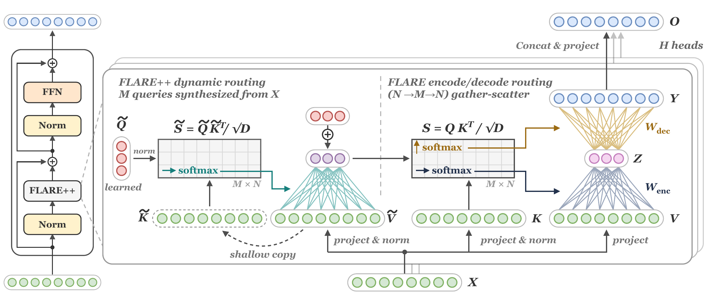
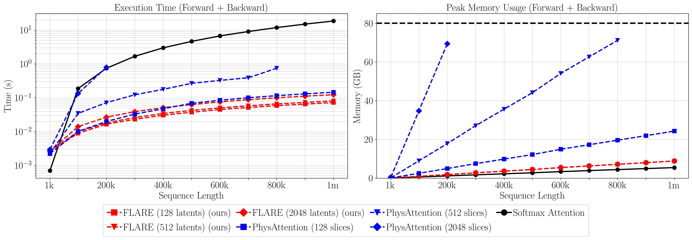
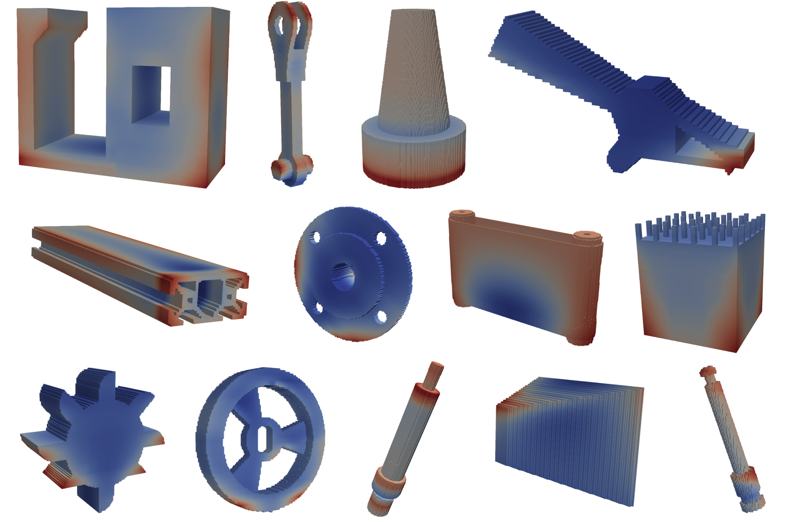

# 🎇 FLARE++ and FLARE: Low-rank attention routing for PDE surrogates

<p align="center">
<a href="https://arxiv.org/abs/2608.11519" alt="arXiv FLARE++">
    </a>
<a href="http://arxiv.org/abs/2508.12594" alt="arXiv FLARE">
    </a>
<a href="https://huggingface.co/papers/2508.12594" alt="HuggingFace">
    </a>
</p>

This repository contains the official implementations of

- **FLARE++: Low-rank attention with attention-synthesized routing** ([arXiv:2608.11519](https://arxiv.org/abs/2608.11519)), and
- **FLARE: Fast Low-rank Attention Routing Engine** ([arXiv:2508.12594](https://arxiv.org/abs/2508.12594)).

## 📝 Blog posts

Detailed write-ups of FLARE and related attention mechanisms:

- [Scaling attention to 1M tokens on a single GPU](https://vpuri3.github.io/blog/scaling-attention-to-1m-tokens-on-a-single-gpu/) — the FLARE gather–scatter mechanism, PDE benchmark results, and scaling analysis.
- [From Encoder to Decoder: Extending FLARE to Memory-Efficient Causal Attention](https://vpuri3.github.io/blog/from-encoder-to-decoder-extending-flare-to-memory-efficient-causal-attention/) — causal FLARE for language modeling: recurrent decode, stable prefill, and training/inference tradeoffs.
- [Higher-Order Attention in Linear Time](https://vpuri3.github.io/blog/adventures-in-high-order-attention/) — linear attention bottlenecks, multilinear memories, Strassen-style mixing, and triple/quad attention.
- [Triple Attention in Triton](https://vpuri3.github.io/blog/triple-attention-in-triton-building-a-third-order-memory-in-linear-time/) — third-order memory in linear time, with a fused Triton kernel compared to the einsum reference.

## 🔥 FLARE++

Latent-space attention methods such as PerceiverIO, Transolver, and FLARE avoid the quadratic cost of full self-attention by routing attention among $N$ tokens through $M \ll N$ learned latents.
Once trained, however, the same learned query templates are used to compress every input.
**FLARE++** removes this restriction with input-conditioned routing queries.
It uses FLARE's own encoder to map the $N$ input tokens to $M$ query tokens, which correct the learned queries.
The adapted queries then determine how that same input is compressed and redistributed.

- **Linear cost, standard kernels.** FLARE++ keeps FLARE's explicit low-rank factorization and $\mathcal{O}(NM)$ complexity. The whole routing operation is three standard scaled dot-product attention (SDPA) calls.
- **Accuracy.** FLARE++ reduces FLARE's error by 25% on average across five standard PDE benchmarks and gets the lowest errors among the efficient models we compare. The gains carry over to the industrial-scale DrivAerML aerodynamics benchmark and to Long Range Arena, where average accuracy improves by 3.1 percentage points over FLARE.
- **Context parallelism.** A multi-GPU context-parallel implementation shards input tokens across devices and never gathers the full token sequence on any one of them.

<p align="center">
  
</p>

The core FLARE++ token mixer, without projections and normalizations (see `FLAREPPMixer` in [`pdebench/models/mixer_backbone.py`](pdebench/models/mixer_backbone.py) for the full module):

```python
import torch.nn.functional as F
def flarepp_multihead_mixer(q0, q_fixed, gate, k0, k, v):
    """
    q0, q_fixed: learned latent tokens [H, M, D]
    gate:        per-head gate in (0, 1) [H, 1, 1]
    k0, k, v:    key / value projections of the input [B, H, N, D]
    """
    q_dyn = F.scaled_dot_product_attention(q0, k0, k0)  # synthesize M queries from the input
    q = q_fixed + gate * q_dyn                           # input-conditioned routing queries
    z = F.scaled_dot_product_attention(q, k, v)          # encode:  N -> M
    y = F.scaled_dot_product_attention(k, q, z)          # decode:  M -> N
    return y
```

### 🔄 Reproducing FLARE++ results

Standard PDE benchmarks (Elasticity, Darcy, Airfoil, Pipe, DrivAerML-40K, LPBF) are launched with [`out/pdebench/run_flarepp_standard.sh`](out/pdebench/run_flarepp_standard.sh), which also runs the baselines under the same backbone:

```bash
DATASET=elasticity MIXER=flarepp bash out/pdebench/run_flarepp_standard.sh
DATASET=darcy      MIXER=flare   bash out/pdebench/run_flarepp_standard.sh
# DATASET: elasticity | darcy | airfoil_steady | pipe | drivaerml_40k | lpbf
# MIXER:   flarepp | flare | mha | transolver | transolverpp | transolver3 | luna | simplifiedflarepp
```

Full-surface DrivAerML training, including the multi-GPU context-parallel runs, is launched with [`out/pdebench/run_flarepp.sh`](out/pdebench/run_flarepp.sh):

```bash
python scripts/download_drivaerml_surface.py --data-root data/DrivAerML/raw
python scripts/prep_drivaerml_surface.py --data-root data/DrivAerML/raw --out-root data/DrivAerML/surface_full

DATASET=drivaerml_surface MODEL=flarepp bash out/pdebench/run_flarepp.sh
DATASET=drivaerml_surface MODEL=flarepp USE_CONTEXT_PARALLEL=true bash out/pdebench/run_flarepp.sh
```

The header of each script documents every environment-variable override and the per-dataset defaults.
Long Range Arena experiments are launched with [`out/lra/run.sh`](out/lra/run.sh), and the time/memory and context-parallel scaling benchmarks are in [`ablation/time_memory_bwd_flarepp.py`](ablation/time_memory_bwd_flarepp.py) and [`ablation/cp_scaling_bwd.py`](ablation/cp_scaling_bwd.py).

## 🎇 FLARE

**FLARE** (Fast Low-rank Attention Routing Engine) is a linear-complexity token mixer for long sequences such as unstructured meshes and point clouds.
Each head gathers the $N$ input tokens into $M \ll N$ learned latent tokens and scatters them back, which is a rank-$M$ form of attention at $\mathcal{O}(NM)$ cost.

- **Independent heads.** Each head gets its own slice of latent queries, so heads learn distinct routing patterns (unlike Transolver's shared projection or LNO's single projection).
- **Accuracy.** FLARE outperforms leading neural PDE surrogates across diverse benchmarks, with fewer parameters.
- **Scale.** FLARE is two fused SDPA calls. It trains end-to-end on one-million-point meshes on a single GPU, over $200\times$ faster than full self-attention at that size.
- **Data.** We release a new additive-manufacturing (LPBF) benchmark dataset.

<p align="center">
  
</p>

```python
import torch.nn.functional as F
def flare_multihead_mixer(q, k, v):
    """
    q: learned latent queries [H, M, D]
    k, v: key / value projections of the input [B, H, N, D]
    """
    z = F.scaled_dot_product_attention(q, k, v, scale=1.0)  # gather:  N -> M
    y = F.scaled_dot_product_attention(k, q, z, scale=1.0)  # scatter: M -> N
    return y
```

<p align="center">
  
</p>

The LPBF dataset simulates laser powder bed fusion on geometries from the Autodesk segmentation dataset (Lambourne et al., 2021); color shows the vertical displacement.

<p align="center">
  
</p>

## 🏗️ Codebase Architecture

This codebase implements the FLARE architecture and is built upon the [`mlutils.py`](https://github.com/vpuri3/mlutils.py/tree/master) framework, which provides foundational ML training infrastructure with multi-GPU support, extendable trainer classes, and callback systems.

The project is organized into several key packages:

### **`pdebench/`** - Main PDE Benchmarking Framework
- **Models**: Implementation of FLARE and FLARE++ alongside state-of-the-art neural PDE surrogates
  - `flare.py`: Core FLARE architecture with linear complexity attention
  - `mixer_backbone.py`: Shared backbone with the FLARE++ (`FLAREPPMixer`), FLARE, and baseline token mixers
  - `flarepp.py`: FLARE++ model with multi-GPU context parallelism (used by `run_flarepp.sh`)
  - `transolver.py`: Transolver baseline model
  - `lno.py`: Linear Neural Operator
  - `transformer.py`: Standard transformer architectures
  - `gnot.py`: Geometry-aware Neural Operator
  - `perceiver.py`: PerceiverIO architecture
- **Datasets**: Comprehensive PDE dataset loading and preprocessing
  - `utils.py`: Dataset utilities and transformations
- **Callbacks**: Training monitoring, evaluation, and visualization

#### **`am/`** - Additive Manufacturing Specialization
- **Models**: Specialized architectures for AM simulations
  - `meshGNN.py`: Graph neural networks for mesh data
- **Datasets**: LPBF (Laser Powder Bed Fusion) data processing
  - `sdf.py`: Signed distance function utilities
  - `extraction.py`: Feature extraction from AM simulations
  - `filtering.py`: Data filtering and preprocessing
- **Visualization**: 3D visualization tools for AM geometries

#### **`mlutils/`** - Core ML Framework (from mlutils.py)
- `trainer.py`: Distributed training with checkpointing and restart capabilities
- `callbacks.py`: Extensible callback system for monitoring and analysis
- `utils.py`: General ML utilities and helper functions

#### **`ablation/`** - Performance Analysis Suite
- Scaling experiments: `scale_dml.py`, `time_memory_*.py`, `cp_scaling_bwd.py`
- Architecture ablations: `ablate_num_heads.py`, `ablate_num_layers.py`, `ablate_num_blocks.py`
- Memory and timing benchmarks with Flash Attention comparisons

### 🚀 Key Features

**Scalable Training Infrastructure**
- Multi-GPU/multi-node training with `torchrun`
- Automatic checkpointing and restart capabilities
- Mixed precision training (FP16/FP32)
- Comprehensive logging and monitoring

**Flexible Model Zoo**
- FLARE++, FLARE, and many of the state-of-the-art neural PDE surrogates
- Modular architecture for easy experimentation

### 💻 Installation

Clone the repository and run the installation script:

```bash
git clone https://github.com/vpuri3/FLARE.py.git
cd FLARE.py
chmod +x scripts/install.sh
./scripts/install.sh
```

The installer will:
- Set up Python 3.11 virtual environment with `uv`
- Install PyTorch with CUDA support
- Install all required dependencies
- Optionally install Flash Attention for optimal performance
- Optionally install LaTeX for publication-quality plots


### 📊 Datasets

This codebase supports a variety of PDE datasets. You can download them using the built-in dataset utility:

```bash
git clone https://github.com/vpuri3/FLARE.py.git
cd FLARE.py
uv run python scripts/download_pdebench_dataset.py
```

### 🎯 Usage

**Training**

Single GPU training:
```bash
uv run python -m pdebench --train true --dataset elasticity --exp_name flare_elas --model_type 2 --epochs 100 ...
```

Multi-GPU training:
```bash
uv run torchrun --nproc-per-node 2 -m pdebench --train true --dataset flare_darcy --exp_name flare_elasticity --model_type 2 --epochs 100 ...
```

Training hyperparameters can be modified with the following command-line arguments:

```
$ uv run python -m pdebench --help
usage: __main__.py [-h] [--config CONFIG] [--print_config[=flags]] [--train {true,false}]
                   [--evaluate {true,false}] [--restart {true,false}] [--exp_name EXP_NAME]
                   [--seed SEED] [--dataset DATASET] [--num_workers NUM_WORKERS] [--epochs EPOCHS]
                   [--batch_size BATCH_SIZE] [--weight_decay WEIGHT_DECAY]
                   [--learning_rate LEARNING_RATE] [--schedule SCHEDULE]
                   [--one_cycle_pct_start ONE_CYCLE_PCT_START]
                   [--one_cycle_div_factor ONE_CYCLE_DIV_FACTOR]
                   [--one_cycle_final_div_factor ONE_CYCLE_FINAL_DIV_FACTOR]
                   [--one_cycle_three_phase {true,false}] [--opt_beta1 OPT_BETA1]
                   [--opt_beta2 OPT_BETA2] [--opt_eps OPT_EPS] [--clip_grad_norm CLIP_GRAD_NORM]
                   [--optimizer OPTIMIZER] [--mixed_precision {true,false}]
                   [--attn_backend ATTN_BACKEND] [--timing_only {true,false}] [--model_type MODEL_TYPE]
                   [--conv2d {true,false}] [--unified_pos {true,false}] [--act ACT]
                   [--channel_dim CHANNEL_DIM] [--num_blocks NUM_BLOCKS] [--num_heads NUM_HEADS]
                   [--num_latents NUM_LATENTS] [--num_layers_kv_proj NUM_LAYERS_KV_PROJ]
                   [--num_layers_mlp NUM_LAYERS_MLP] [--num_layers_in_out_proj NUM_LAYERS_IN_OUT_PROJ]
                   [--mlp_ratio MLP_RATIO] [--kv_proj_ratio KV_PROJ_RATIO]
                   [--in_out_proj_ratio IN_OUT_PROJ_RATIO] [--out_proj_ln {true,false}]
```

Each training run will create a directory in `out/pdebench` where it would store checkpoints.

```
$ tree out/pdebench/ -L 2
out/pdebench
├── flare_elas
│   ├── ckpt01
│   ├── ...
│   ├── ckpt10
│   ├── config.yaml
│   ├── grad_norm.png
│   ├── learning_rate.png
│   ├── losses.png
│   ├── rel_error.json
│   └── model_stats.json
└── flare_darcy
    ├── ckpt01
    ├── ...
    ├── ckpt10
    ├── config.yaml
    ├── grad_norm.png
    ├── learning_rate.png
    ├── losses.png
    ├── rel_error.json
    └── model_stats.json
```

**Evaluation**

Load and evaluate a trained model:
```bash
python -m pdebench --eval true --exp_name flare_elasticity
```

**Configuration**

All experiments are managed through YAML configuration files with comprehensive command-line override support. Results are automatically organized in the `out/` directory with:
- Model checkpoints
- Training logs and metrics
- Evaluation results and visualizations
- Configuration snapshots

### 📊 Datasets

**PDE Benchmarks**
- Supports multiple standard PDE benchmark datasets
- Scalable data loading for large mesh datasets
- Flexible preprocessing and augmentation pipelines

**Additive Manufacturing Dataset**
- New benchmark dataset with LPBF simulations
- Generated on Autodesk segmentation geometries
- Includes displacement fields and thermal histories

### 🔄 Reproducibility

For FLARE++, see [Reproducing FLARE++ results](#-reproducing-flare-results) above. The main FLARE results can be reproduced by running the script:

```
chmod +x ./out/pdebench/run_comp.sh
./out/pdebench/run_comp.sh
```

### 🔬 Research Applications

- **Neural PDE Surrogates**: Fast approximation of expensive PDE solvers
- **Point Cloud Processing**: Large-scale geometric deep learning
- **Scientific Computing**: Scalable transformer architectures for irregular data

## Bibtex
```
@misc{puri2026flarepp,
      title={{FLARE++}: Low-rank attention with attention-synthesized routing},
      author={Vedant Puri and Sri Datta Ganesh Bandreddi and Yongjie Jessica Zhang and Levent Burak Kara},
      year={2026},
      eprint={2608.11519},
      archivePrefix={arXiv},
      primaryClass={cs.LG},
      url={https://arxiv.org/abs/2608.11519},
}

@misc{puri2025flare,
      title={{FLARE}: {F}ast {L}ow-rank {A}ttention {R}outing {E}ngine}, 
      author={Vedant Puri and Aditya Joglekar and Kevin Ferguson and Yu-hsuan Chen and Yongjie Jessica Zhang and Levent Burak Kara},
      year={2025},
      eprint={2508.12594},
      archivePrefix={arXiv},
      primaryClass={cs.LG},
      url={https://arxiv.org/abs/2508.12594}, 
}
```
